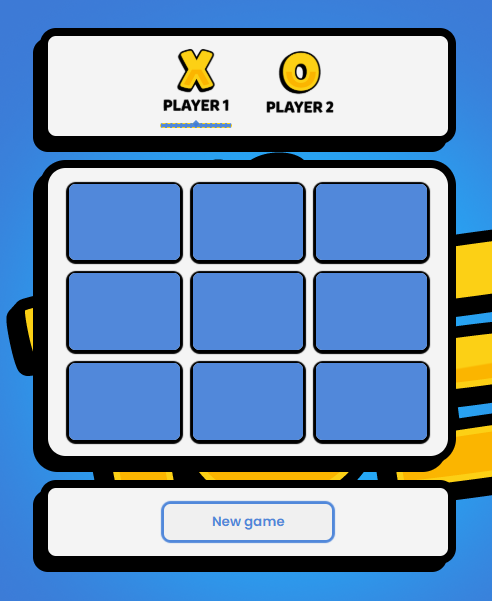

# Tic-Tac-Toe Game 🎮
- A responsive React implementation of the classic Tic-Tac-Toe game with turn indicator, winner announcement, and restart functionality.

## Features ✨
- 🕹️ Interactive game board with React state management
- 🔄 Turn indicator showing whose turn it is (X or O)
- 🏆 Automatic winner detection with announcement
- 🔄 Restart button to reset the game at any time
- 📱 Fully responsive design (works on mobile & desktop)

## Technologies Used 💻
1. HTML5
2. CSS3 (Flexbox/Grid for responsive design)
3. React.js (with Hooks)

## Live Demo 🔥
[Play Now](https://tic-tac-toe-game-theta-three.vercel.app/)